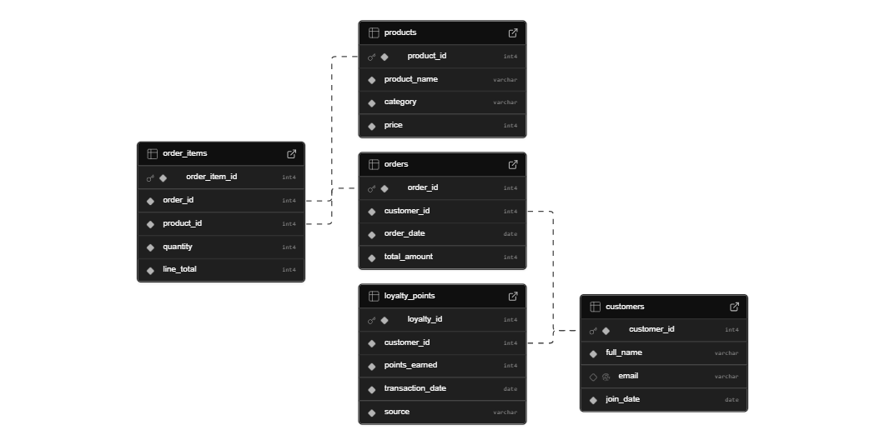

# 📊LaunchMart Loyalty Analytics

Hey there!👋  
This repository holds all the SQL queries I wrote to tackle the LaunchMart loyalty program analysis project. LaunchMart is a growing African e-commerce company that recently launched a loyalty program to increase customer retention.  
The goal is to help the marketing and operations teams make data-driven decisions on customer behaviour, revenue performance, and loyalty engagement.

## 📚 Data Setup and Environment
This analysis was performed using PostgreSQL within a Dockerized environment.
### Database Schema
The database schema includes the following core tables:  
`customers`: Customer's master data (`customer_id`, `full_name`, `email`, `join_date`).

`orders`: Order details (`order_id`, `customer_id`, `order_date`, `total_amount`).

`loyalty_points`: Points earned by customers (`customer_id`, `points_earned`, `loyalty_id`, `transaction_data`, `source`).  

The other tables (`products` and `order_items`) were available but not used in the core reports.

### Setup Instructions
The database setup was completed by running the Data Definition Language (DDL) and Data Manipulation Language (DML) files:  
* Schema Creation: Executed the DDL statements in `01_schema.sql`.
* Data Seeding: Inserted sample data into the created tables using `02_seed_data.sql`.

## 🛠 Tools Used
* pgAdmin 4
* PostgreSQL
* Docker
